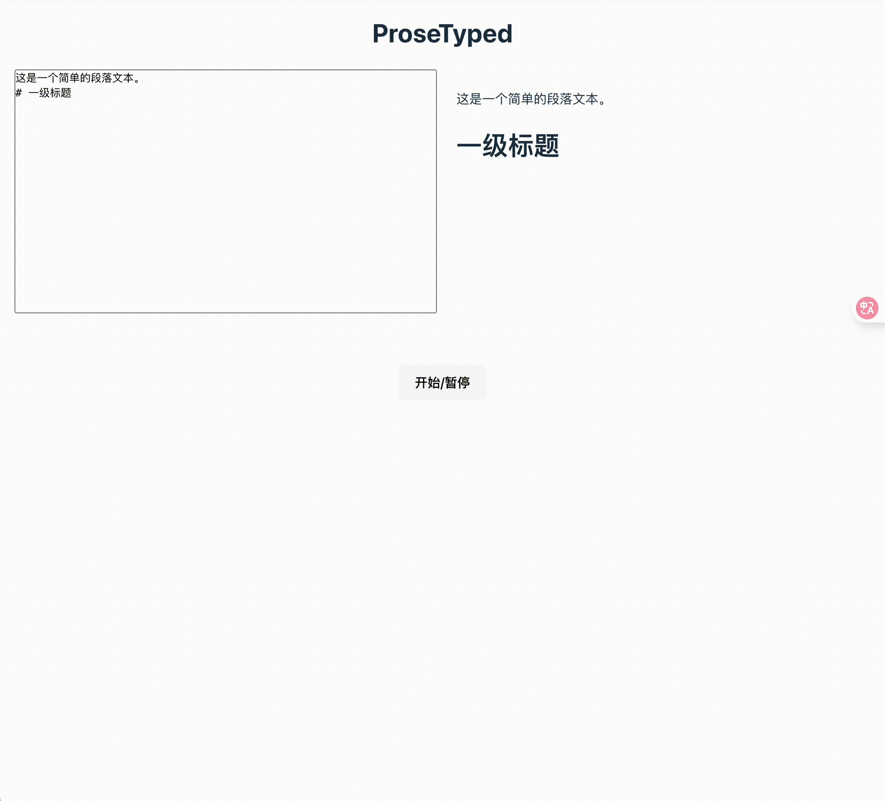

# ProseTyped



English | [中文](./README_CN.md)

ProseTyped is a typing effect library designed for ProseMirror, adding typewriter effects to your editor.

## Installation

```bash
npm install prose-typed
# or
yarn add prose-typed
```

## Usage

### Basic Usage

```typescript
import { ProseTyped } from 'prose-typed';
import { Schema, Node } from 'prosemirror-model';

// Create a ProseMirror node
const schema = new Schema({
  // Your schema configuration
});
const node = schema.node('doc', null, [
  schema.node('paragraph', null, schema.text('This is text that will have a typing effect'))
]);

// Create ProseTyped instance
const proseTyped = new ProseTyped(node, {
  // Optional configuration
  typingSpeed: 50, // Typing speed (milliseconds)
  showCursor: true, // Show cursor
  autoStart: true, // Auto start
});

// Listen for view updates
proseTyped.on('view', (fragment) => {
  // Use the fragment to update your view
  // Example: editorView.dispatch(tr.replaceWith(0, editorView.state.doc.content.size, fragment));
});

// Listen for completion
proseTyped.on('complete', () => {
  console.log('Typing effect completed');
});

// Control methods
proseTyped.start(); // Start typing effect
proseTyped.pause(); // Pause
proseTyped.stop();  // Stop and jump to end
proseTyped.destroy(); // Destroy instance, clear timers
```

## Event System

ProseTyped uses mitt as its event system and provides the following events:

| Event Name | Description | Parameters |
| ---------- | ----------- | ---------- |
| `view` | Triggered when the view updates | `Fragment` - ProseMirror document fragment |
| `complete` | Triggered when typing effect completes | None |

```typescript
// Listen for view updates
proseTyped.on('view', (fragment) => {
  // Use fragment to update your view
  const html = DOMSerializer.fromSchema(schema).serializeFragment(fragment);
  previewerEl.replaceChildren(html);
});

// Listen for completion event
proseTyped.on('complete', () => {
  console.log('Typing effect completed');
});

// Remove event listener
proseTyped.off('view', handlerFunction);
```

## Methods

The ProseTyped class provides the following methods:

| Method Name | Description | Parameters |
| ----------- | ----------- | ---------- |
| `start()` | Start or continue typing effect | None |
| `pause()` | Pause typing effect | None |
| `stop()` | Stop typing effect and jump to end | None |
| `updateNode(newNode, showCursor?)` | Update node content | `newNode: Node` - New ProseMirror node  
`showCursor?: boolean` - Whether to show cursor |
| `showCursor()` | Show cursor | None |
| `hideCursor()` | Hide cursor | None |
| `destroy()` | Destroy instance, clear all timers | None |

## Properties

| Property Name | Type | Description |
| ------------- | ---- | ----------- |
| `isRunning` | `boolean` | Whether typing effect is running |
| `on` | `Function` | Add event listener |
| `off` | `Function` | Remove event listener |

## Configuration Options

```typescript
interface IOptions {
  showCursor: boolean;       // Whether to show cursor
  typingSpeed: number;       // Typing speed (milliseconds)
  autoStart: boolean;        // Whether to auto start
  delayStartTime: number;    // Delay start time (milliseconds)
  blinkInterval: number;     // Cursor blink interval (milliseconds)
  cursorMark?: string;       // Mark type for cursor
  ignoreAttributes: (        // Attributes to ignore
    | {
        node: string;        // Node type
        attributes: string[]; // Attribute names
      }
    | string
  )[];
}
```

| Option Name | Type | Default | Description |
| ----------- | ---- | ------- | ----------- |
| `showCursor` | `boolean` | `true` | Whether to show cursor |
| `typingSpeed` | `number` | `1000 / 30` | Typing speed (milliseconds) |
| `autoStart` | `boolean` | `true` | Whether to auto start typing effect |
| `delayStartTime` | `number` | `0` | Delay start time (milliseconds) |
| `blinkInterval` | `number` | `500` | Cursor blink interval (milliseconds) |
| `cursorMark` | `string` | `undefined` | Mark type for cursor, used for custom cursor styling |
| `ignoreAttributes` | `Array` | `[]` | Attributes to ignore when comparing nodes |

## Development

```bash
# Install dependencies
npm install

# Start development server
npm run dev

# Build library
npm run build:lib

# Preview
npm run preview
```

## License

MIT
